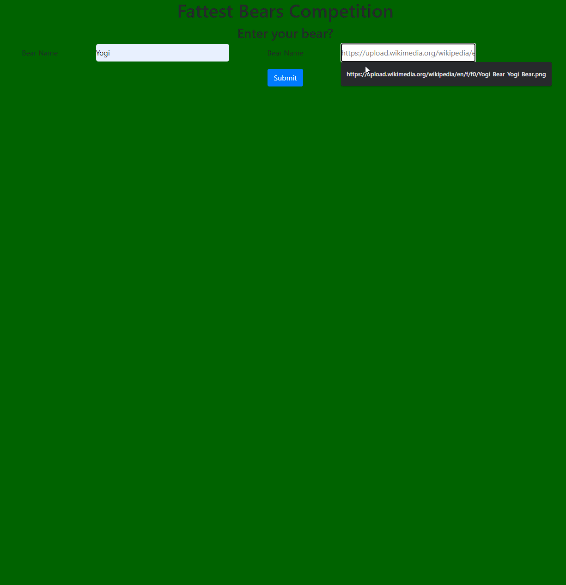

# Bear Watcher  

This project was to learn to organize javascript into modules and import them.  
This includes markup with html5, styling with css and bootstrap as well as vanilla javascript.

This page takes in a bear name and an image. It displays a card for that bear witha  random weight. The cards also have numbers to record how many fish were caught on how many attempts. There's also a slider to determine the size of fish to catch which determines the difficulty to catch. When a fish is caught, it adds weight to the bear. In the top left corner of the card, the bears are given trophys based on their total weight.  
There are also buttons that assign random fish size for each bear to catch and a button for all bears to attempt to fish at the same time.

## Preview

## Technologies Used

     

## View Project

* Clone the repository `$ git clone git@github.com:spotmonk/pet-adoption.git`
* Run any HTTP server. My favorite is installed with `$ npm install http-server` and run with a `$ hs`
